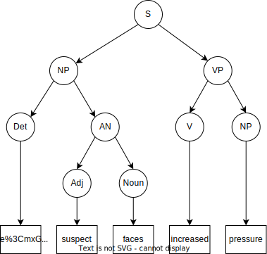

# DD2417 Language Engineering - Assignment 1

## Mandatory questions

> 1. Find all the syntax trees derivable from the sentence *“He built the box with a hammer in the yard behind the house”*


> Convert the following grammar into a weakly equivalent Chomsky normal form grammar.

```grammar
S   → NP VP         Noun → faces
NP  → Det Adj Noun  Noun → suspect
NP  → Adj Noun      Noun → pressure
NP  → Det Noun       Adj → increased
NP  → Noun           Adj → suspect
VP  → V NP             V → faces
Det → the              V → increased
```

become

```grammar
S   → NP VP       Noun → faces
NP  → Det AN      Noun → suspect
AN → Adj Noun      Adj → suspect
NP  → Adj Noun    Noun → pressure
NP  → Det Noun     Adj → increased           
VP  → V NP           V → faces
Det → the            V → increased
NP → faces          NP → pressure
NP → suspect
```

> Using your new grammar, use the CKY algorithm to parse the sentence “the suspect faces increased pressure”. Show your completed parse table as result.

| the | suspect     | faces     | increased | pressure |
| --- | ----------- | --------- | --------- | -------- |
| Det | NP          | NP        |           | S S      |
|     | NP Adj Noun | NP AN     |           | S S      |
|     |             | NP V Noun |           | S VP     |
|     |             |           | Adj V     | NP VP AN |
|     |             |           |           | NP  Noun |

And if we extract all the trees we get:




> Each of these dependency trees has one edge which is incorrect. Decide which one, and explain how it should be drawn instead.

In the **a** tree, the root edge is incorrect. It should be drawn from **ROOT** to **wanted** and not the opposite.

In the **b** tree, the edge from **lasted** to **The** is incorrect. It should be drawn from **meeting** to **The**.

In the **c** tree, the edge from **gave** to **brother** is incorrect. It should be drawn from **gave** to **book**.

> Below is a correct dependency tree, but with the labels missing. For each of the labels 1–7, determine the appropriate relation label.

1. root
2. nsubj
3. amod
4. det
5. advmod
6. obj
7. det
